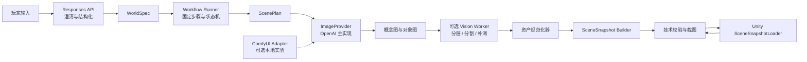

# PetTrip MVP 技术路线

本文档定义 PetTrip 两个最小 MVP 的技术路线、模块边界和适配策略。目标是用最少的基础设施验证“用户输入能否稳定变成可被 Unity 消费的互动景观”，再验证 Responses 生产闭环与 Codex 演进闭环能否共享同一内容契约。

本路线以团队已经熟悉 OpenAI 图像模型和 Unity 为前提。OpenAI Images API 是首轮默认图片生成提供方，默认使用团队当前验证过的 `image-2` 配置；模型 ID 仍保持可配置。ComfyUI 仅作为可选的本地实验和后处理适配器，不成为生产链路依赖。

<!-- prettier-ignore -->
> [!IMPORTANT]
> 首轮先建设可重放的固定 Workflow，再增加受约束的 Agent 控制层。Agent 不生成 Unity 运行时代码，也不直接修改 Unity 工程。

## 1. 目标与边界

### 1.1 MVP 需要回答的问题

MVP 1 验证哪条美术生产路线能够稳定输出视觉合格、结构合法、可装载的 `SceneSnapshot`。MVP 2 验证 Responses 能使用已验证 Workflow 生产内容，Codex 能基于失败证据改进 Workflow，并由 Responses 复现改进。

首轮场景采用横向 2D、固定镜头或很短的横向活动区域。场景包含远景、中景、地面、可选前景、一个核心地标、一个宠物互动点和一个共建槽位。

### 1.2 明确不做的事情

- 不生成或执行新的 Unity C#、Prefab 或场景脚本。
- 不让 Agent 自由规划碰撞、导航和渲染排序。
- 不在首轮构建开放世界、多人同步、经济系统和复杂宠物 AI。
- 不在生成路线稳定前建设 Temporal、Kafka、复杂多 Agent 编排或动态 AssetBundle 平台。
- 不把 ComfyUI、MCP 或 Addressables 设为内容生产的隐性依赖。

## 2. 总体架构

业务 Workflow 负责步骤、状态、重试和降级；图片提供方负责生成或编辑图片；Unity 只消费版本化的 `SceneSnapshot`。



### 2.1 运行时与服务栈

| 层 | 首选技术 | 首轮职责 |
| --- | --- | --- |
| Unity 客户端 | Unity 6 LTS、URP 2D Renderer、C# | 模板场景、宠物动作、拍照、共建、Snapshot 加载 |
| 内容服务 | Python 3.12、FastAPI、Pydantic v2 | 任务入口、契约校验、Workflow Runner、产物索引 |
| 图片生成 | OpenAI Images API，模型 ID 配置化 | 概念图、核心地标、共建物变体 |
| 图片处理 | Pillow、OpenCV | 尺寸、Alpha、裁剪、合成、确定性校验 |
| 视觉处理 | 独立 Python Worker，可选 Grounded SAM 2、BiRefNet、LaMa | 对象定位、抠图、背景补全 |
| 持久化 | 开发期本地 artifact 目录 + SQLite | 中间产物、运行事件、报告和重放 |
| 正式对象存储 | S3 兼容存储，按需引入 | 图片、截图、报告和发布资产 |
| Unity 自动验证 | Unity Test Framework、Batchmode、固定相机 | 加载、交互、共建后重载和截图 |
| Codex 开发接入 | Unity MCP，可选 | 编辑器自动化、测试和诊断，不进入生产协议 |

首轮不需要 Redis 队列。Workflow Runner 可以在一个进程中顺序执行步骤；只有出现长耗时、跨进程或并发生产需求时再引入队列。

## 3. 核心内容契约

所有 Agent、图片提供方和 Unity 逻辑都通过版本化 JSON 契约通信。契约正文只维护一份，Agent Prompt、工具 Schema 和测试案例从契约生成或同步。

```text
contracts/
  world-spec/v0.1.schema.json
  scene-plan/v0.1.schema.json
  asset-spec/v0.1.schema.json
  scene-snapshot/v0.1.schema.json
  validation-report/v0.1.schema.json
  job-event/v0.1.schema.json
  tool-error/v0.1.schema.json
```

### 3.1 WorldSpec

`WorldSpec` 是玩家意图的锁定结果，不包含 Unity 实现细节。它至少包含主题、画风、镜头、必须出现项、禁止项、活动区语义、互动语义和共建需求。

### 3.2 ScenePlan

`ScenePlan` 将 `WorldSpec` 转换为有限空间布局。它只描述可验证的结构：画布尺寸、层级、锚点、对象位置、活动区多边形、互动点、共建槽位和允许的内置 Prefab。

### 3.3 SceneSnapshot

`SceneSnapshot` 是 Unity 的稳定消费边界。示例：

```json
{
  "schema_version": "0.1",
  "scene_id": "scene_001",
  "canvas": { "width": 1920, "height": 1080 },
  "layers": [
    { "id": "background", "uri": "assets/background.png", "sorting_order": 0 },
    { "id": "midground", "uri": "assets/midground.png", "sorting_order": 10 },
    { "id": "landmark", "uri": "assets/lighthouse.png", "sorting_order": 30 }
  ],
  "activity_zone": {
    "type": "polygon",
    "points": [[100, 760], [1600, 760], [1750, 1000], [80, 1000]]
  },
  "interactions": [
    { "id": "pet_tide", "kind": "pet_action", "anchor": [850, 820] }
  ],
  "build_slots": [
    { "id": "slot_01", "position": [1450, 850], "allowed_prefabs": ["small_shelter"] }
  ]
}
```

Unity 不读取生成服务的 Prompt、节点名称、模型特有字段或临时文件名。每个外部资产使用稳定 URI、内容哈希和资产元数据登记。

## 4. 用户输入到游戏资产的 Workflow

### 4.1 输入理解

Responses API 负责澄清缺失信息，并通过 Structured Outputs 产生 `WorldSpec`。确定性校验负责发现必填字段缺失、required/forbidden 冲突和不支持的场景能力。

输出失败时只允许三种结果：追问、拒绝或降级到已支持的模板能力。

### 4.2 场景规划

Workflow Runner 根据 `WorldSpec` 和模板库产生粗粒度 `ScenePlan`。模板库固定相机、活动区候选形状、交互类型、共建槽位和 Sorting Layer。LLM 可以提出语义布局，但最终位置必须经过确定性约束。

### 4.3 概念图与独立对象生成

主路线使用 OpenAI Images API：

1. 生成完整概念图，锁定整体构图和画风。
2. 根据 `ScenePlan` 生成核心地标和共建物的独立变体。
3. 保存请求参数、参考图 URI、模型配置、运行时间和结果哈希。

图片提供方接口保持稳定：

```python
class ImageProvider(Protocol):
    def generate(self, request: ImageRequest) -> ImageArtifact: ...
    def edit(self, request: ImageEditRequest) -> ImageArtifact: ...
```

`OpenAIImageProvider` 是默认实现。`ComfyUIProvider` 只把抽象请求转换为 ComfyUI 的 workflow JSON，并返回同样的 `ImageArtifact`，业务层不得依赖 ComfyUI 节点名。

### 4.4 分层、分割与补洞

首轮只拆必须交互或替换的对象，不追求任意概念图的完整语义分层。推荐按以下顺序做能力对照：

| 方案 | 适配方式 | 首轮定位 |
| --- | --- | --- |
| Qwen-Image-Layered | 独立 Diffusers Worker | 整图到多 RGBA 层的能力探针 |
| Grounded SAM 2 | 独立 Python Worker | 根据“灯塔、树、建筑”等文本提取对象 mask |
| BiRefNet | 独立 Python Worker | 改善细边缘和半透明对象抠图 |
| LaMa | 独立 Python Worker | 对象移除后的背景补全 |
| Pillow/OpenCV | 内容服务内置库 | 组合、裁剪、尺寸和确定性技术校验 |

Qwen-Image-Layered 的官方 Pipeline 已支持 image-to-multi-RGBA，但文本直接生成多层的能力有限。因此它不能替代 `ScenePlan`，也不能单独保证每层语义正确。

### 4.5 资产规范化

资产规范化器将所有图片转换为 Unity 可消费的固定格式：

- 统一设计分辨率和颜色空间。
- 保留 RGBA，校验透明通道。
- 固定锚点、pivot、裁剪边界和像素坐标。
- 生成 `asset-manifest.json`。
- 计算内容哈希，支持中间产物重放和缓存。

这部分只使用 Pillow、OpenCV 和 Pydantic，不通过 LLM 做决定。

### 4.6 SceneSnapshot 组装

`SceneSnapshot Builder` 把 `ScenePlan`、规范化资产和模板引用组装成 Snapshot，并运行 JSON Schema 校验。它必须在没有 Unity 的情况下完成确定性检查，再交给 Unity。

### 4.7 Unity 加载与体验验证

`SceneSnapshotLoader` 负责：

1. 读取 Snapshot。
2. 加载背景和图层 Sprite。
3. 按 Snapshot 设置位置、排序和缩放。
4. 创建活动区、互动点和共建槽位。
5. 调用内置宠物动作库。
6. 保存共建后的 Snapshot 版本并重新加载。

首轮活动区使用 Snapshot 中的多边形约束；只有自由移动需求扩大后才引入 [NavMeshPlus](https://github.com/h8man/NavMeshPlus)。

## 5. ComfyUI 的准确定位

ComfyUI 是独立的本地执行器，不是 PetTrip 的业务工作流引擎。它通过 HTTP API 接收 workflow JSON，返回生成结果；PetTrip 不把 ComfyUI 的客户端、节点图或模型目录写入核心契约。

### 5.1 主生产链路

```text
Workflow Runner
  -> OpenAIImageProvider
  -> ImageArtifact
  -> Vision Worker（可选）
  -> SceneSnapshot
```

### 5.2 可选实验链路

```text
Workflow Runner
  -> ComfyUIProvider
  -> ComfyUI /prompt
  -> prompt_id / history / output
  -> ImageArtifact
```

ComfyUI 适合比较 Flux、ControlNet、IP-Adapter、LayerDiffuse 等本地路线，或执行 OpenAI API 不方便表达的复杂后处理。它不能成为首轮启动的必要服务。

## 6. 适配矩阵

下表中的“原生”表示官方接口或稳定库直接支持；“半适配”表示存在社区节点或明确 API，但需要锁版本和编写胶水；“自研”表示没有可直接复用的稳定连接。

| 环节 | 状态 | 首轮处理 |
| --- | --- | --- |
| Responses -> WorldSpec | 原生 | Structured Outputs + Pydantic |
| WorldSpec -> ScenePlan | 自研 | JSON Schema + 模板规则 |
| OpenAI Images -> ImageArtifact | 原生 | `OpenAIImageProvider` |
| ComfyUI -> ImageArtifact | 半适配 | 可选 Adapter，不进入主链路 |
| ControlNet/IP-Adapter -> ComfyUI | 半适配 | 锁 ComfyUI、节点和模型版本后实验 |
| Qwen Layered -> RGBA | 原生到 Python | 独立 Worker，保存 PNG 与 metadata |
| Grounded SAM 2 -> mask JSON | 原生到 Python | 独立 Worker，文本指定对象 |
| mask -> clean plate | 半适配 | LaMa Worker；失败时人工或整体背景降级 |
| RGBA -> asset manifest | 自研 | Pillow/OpenCV 确定性处理 |
| assets + plan -> SceneSnapshot | 自研 | Snapshot Builder |
| SceneSnapshot -> Unity | 自研 | `SceneSnapshotLoader` |
| activity polygon -> movement | 自研 | 首轮多边形约束 |
| movement collider -> NavMesh | 半适配 | 后续评估 NavMeshPlus |
| Snapshot -> Addressables | 原生能力 | MVP 1 不启用，正式发布再接 |
| Codex -> Unity Editor | 已有社区适配 | Unity MCP 仅用于研发和测试 |

## 7. MVP 阶段与交付物

### M0：内容契约与 Unity 载体

M0 先证明有限分层互动景观成立，不调用 Agent 或图片模型。

交付物：

- `WorldSpec`、`ScenePlan`、`SceneSnapshot`、`ValidationReport` Schema。
- Unity 空模板和 `SceneSnapshotLoader`。
- 一套人工准备的背景、地标、共建物。
- 抵达、宠物互动、拍照、共建、重新加载闭环。

退出条件：同一模板可以加载两个视觉差异明显的 Snapshot，且不修改运行时代码。

### MVP 1-A：能力探针

对 OpenAI 概念图、独立对象编辑、Qwen Layered、Grounded SAM 2 分别做单例探针。每个探针保存完整输入、输出、模型配置和失败日志。

退出条件：每种关键动作都有可进入 Unity 的结果，或有明确淘汰证据。

### MVP 1-B：固定 Workflow 对照

以 W1、W2、W3 对照结构先行、画面先行和混合路线。首轮推荐路线是：

```text
粗 ScenePlan
 -> OpenAI 完整概念图
 -> 只拆核心地标和共建物
 -> SceneSnapshot
```

退出条件：保留最多两条路线，并记录画面质量、装载成功率、人工修复时间和失败阶段。

### MVP 1-C/D：重复运行与薄 Agent

对保留路线运行 W1-W6，每个输入至少重复两次。只对最终候选路线加入受约束的 Agent 控制层；允许的动作包括指定节点重试、请求澄清、选择降级和请求人工审核。

退出条件：选出主路线、降级路线和明确适用边界。

### MVP 2：生产与演进闭环

Responses 使用固化 Workflow 生产一次真实任务；Codex 重放同一任务，基于证据完成一项改进，并在固定样本上验证后回写 Workflow；Responses 使用新版本复现。

## 8. 验收指标

硬门槛如下：

- `SceneSnapshot` Schema 合法率为 100%。
- Unity 加载成功率至少为 90%。
- 成功场景均包含活动区、互动点和共建槽位。
- 两次重试内完成率至少为 90%。
- 禁止元素严重违规率为 0%。
- 共建后 Snapshot 可以重新加载。
- 不因单个生成结果修改 Unity 运行时代码。

视觉质量由至少三名评审盲评。VLM 分数只做辅助证据，不替代人工发布判断。

## 9. 依赖与版本策略

首轮将 AI 依赖拆成独立环境，避免 ComfyUI、SAM2 和 Diffusers 互相污染：

```text
content-service/
  Python 3.12
  FastAPI, Pydantic, OpenAI SDK, Pillow, OpenCV

vision-worker/（可选）
  独立 Python 环境
  PyTorch, Grounded SAM 2, BiRefNet, LaMa 或 Qwen Layered

comfyui-experiment/（可选）
  ComfyUI 固定 commit
  custom nodes 固定 commit
  workflow JSON 固定版本
```

每次运行保存 `pipeline_version`、模型配置、节点版本、Prompt/Workflow 哈希和 Unity 版本。模型仓库许可证不等同于模型权重许可证，商业化前必须单独审核权重条款。

## 10. 主要风险与降级

### 分层质量不足

保留完整概念图作为背景，只拆必须互动的对象。若对象拆分仍失败，使用预生成透明 Prefab 或整体背景降级。

### OpenAI 图片结果不可重复

把运行目标从“实时生成”降为“预生成并缓存 SceneSnapshot”。现场演示只触发任务创建和加载，不等待完整生成。

### 视觉对象与空间规则不一致

活动区、互动点和共建槽位由模板和 Schema 约束，不从图像像素自动推断。

### ComfyUI 环境漂移

ComfyUI 只做实验；实验结果必须导出为普通 PNG 和 metadata，再进入统一 Snapshot。任何 ComfyUI 节点都不能成为 Unity 运行时依赖。

## 11. 推荐实施顺序

1. 完成 M0 的 Snapshot Loader 和人工资产闭环。
2. 接入 `OpenAIImageProvider`，保存可重放 artifact。
3. 完成资产规范化器和 Snapshot Builder。
4. 独立验证 Qwen Layered 与 Grounded SAM 2，二选一进入主路线。
5. 运行三条路线的 W1-W3 对照实验。
6. 对候选路线运行 W1-W6 重复实验。
7. 最后加入受约束 Agent，并进入 MVP 2 的 Responses/Codex 闭环。

## 12. 下一步

下一步应先实现 M0 的最小纵向骨架和契约，而不是安装 ComfyUI。M0 通过后，再用三个样例比较 OpenAI 图片直出、OpenAI 图片加独立分割、以及可选 ComfyUI 后处理的差异。
