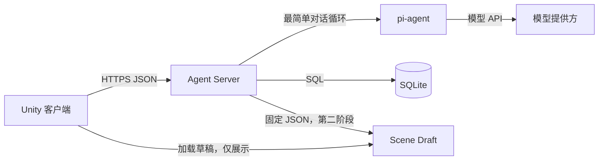

# pi-agent 与 Unity 联调 MVP 需求文档

本文档定义首轮服务器端 pi-agent 与 Unity 客户端联调的最小需求。
目标是先证明 Unity 能安全、稳定地调用部署在服务器上的 Agent，并能保存和恢复对话与结构化结果。本文档不要求接入正式的场景生成、图片生成或 `SceneSnapshot` 生产 Workflow。

<!-- prettier-ignore -->
> [!NOTE]
> 这是实验性 MVP。第一阶段使用 pi-agent 的最简单对话循环，并用服务端固定数据模拟结构化游戏结果。正式业务 Workflow 在本 MVP 联调通过后再接入。

## 1. 背景与目标

Unity 当前主要面向本地游戏开发，尚未验证云端 Agent 调用、服务端存档和网络状态恢复。本 MVP 将这三个问题拆开：Unity 只调用后端 API；后端调用 pi-agent；SQLite 只由后端访问。

本 MVP 的成功不以 Agent 回复质量或生成内容质量为标准。成功标准是 Unity 到服务器、服务器到 pi-agent、服务器到 SQLite 的完整链路可重放、可观察并可恢复。

## 2. 系统边界

### 2.1 系统结构

本期采用单服务器、单后端进程和 SQLite 的简单结构。



### 2.2 信任边界

以下边界必须保持明确：

- Unity 不直接访问 SQLite 文件或任何数据库。
- Unity 不持有 pi-agent、模型提供方或数据库的密钥。
- Unity 不直接调用模型提供方 API。
- Agent 的自然语言回复不能直接驱动 Unity 游戏行为。
- 只有服务端校验通过的版本化 JSON 可以作为 Unity 的结构化输入。

### 2.3 本期不包含的能力

本期不包含正式内容生产能力，避免多个不确定性同时进入联调。

- 不接入 OpenAI Images API、ComfyUI、分层、抠图或图片上传。
- 不接入 `WorldSpec`、`ScenePlan`、`SceneSnapshot` 正式生产流程。
- 不生成或修改 Unity C#、Prefab、Scene 或运行时脚本。
- 不实现账号登录、支付、多人同步、排行榜或复杂权限。
- 不实现 WebSocket、消息队列、Redis、PostgreSQL 或对象存储。
- 不要求实时流式展示 Agent token；首轮返回任务最终状态即可。

## 3. 角色与职责

本 MVP 只有三个运行时角色。职责分离用于保证客户端、Agent 和数据层可以独立排错。

| 角色 | 职责 | 不负责的事项 |
| --- | --- | --- |
| Unity 客户端 | 发起请求、轮询状态、显示文本、保存 `session_id`、读取结构化草稿 | 数据库访问、密钥保存、业务规则判定 |
| Agent Server | HTTP API、pi-agent 调用、SQLite 持久化、参数校验、错误映射 | Unity 场景逻辑和 UI |
| pi-agent | 按最简单对话循环生成助手回复 | 数据库访问、直接向 Unity 发请求、直接执行游戏行为 |

## 4. 技术约束

### 4.1 服务端

服务端部署在团队控制的服务器上。推荐使用 Node.js 和 TypeScript，以减少 pi-agent 接入层的跨语言复杂度。HTTP 框架可以使用 Fastify 或 Hono，但 API 语义不依赖特定框架。

服务端必须：

- 从环境变量读取模型 API Key、pi-agent 配置和数据库路径。
- 仅监听受保护的网络接口，并使用 HTTPS 对外提供服务。
- 使用 JSON 作为 Unity 与服务器之间的结构化数据格式。
- 为每个请求分配或传播 `request_id`，为每个 Agent 调用分配 `run_id`。
- 在进程重启后保留已完成任务、失败任务和会话消息。

### 4.2 数据库

首轮数据库使用 SQLite。SQLite 仅用于单服务器 MVP，数据库文件不通过 HTTP 暴露，也不由 Unity 直接访问。

服务端启动时必须执行：

```sql
PRAGMA journal_mode = WAL;
PRAGMA busy_timeout = 5000;
PRAGMA foreign_keys = ON;
```

数据库不存储模型密钥、原始二进制大文件或 Unity 资源包。普通数据以列或 JSON 文本存储；将来需要图片和大型 Snapshot 时，数据库只保存 URI、哈希和元数据。

### 4.3 Unity

Unity 通过 `UnityWebRequest` 调用 HTTPS JSON API。客户端使用 DTO 将 JSON 反序列化为 C# 数据结构，避免将 Agent 自由文本直接映射为游戏对象。

客户端本地至少保存：

- `player_id`：首轮可为匿名 UUID。
- `session_id`：用于恢复同一对话会话。
- 最近成功的 `run_id`：用于断线后的状态查询。
- 服务端基础 URL：开发环境可由配置文件设置。

## 5. 用户流程

### 5.1 第一阶段：文本对话通路

此阶段用于验证 Unity 到 pi-agent 的最小路径。用户在 Unity 中输入一句文本，客户端创建任务并轮询任务结果。

1. Unity 调用 `POST /api/v1/agent-runs`。
2. 服务端创建 `agent_run` 记录，状态为 `queued`。
3. 服务端执行 pi-agent 最简单对话循环，状态更新为 `running`。
4. 服务端保存用户消息和助手最终文本。
5. 服务端将任务置为 `succeeded` 或 `failed`。
6. Unity 每秒查询一次任务状态，直到终态。
7. Unity 显示助手最终文本，并保存 `session_id`。

### 5.2 第二阶段：会话恢复

此阶段用于验证 SQLite 持久化和 Unity 重启后的恢复能力。Unity 根据保存的 `session_id` 请求消息历史，按时间顺序显示已持久化的用户和助手消息。

### 5.3 第三阶段：结构化草稿通路

此阶段用于证明 Agent 的结果能够以受控结构交给 Unity。服务端在 Agent 成功后返回固定的 `SceneDraft` 示例，或通过一个受 JSON Schema 约束的服务端 Tool 写入草稿。

Unity 只读取并展示 JSON 中允许的字段，例如标题、主题、描述和预留地标。此阶段不加载正式场景、不调用图片模型。

## 6. API 需求

所有 API 路径使用 `/api/v1` 前缀，传输格式为 `application/json; charset=utf-8`。所有响应都必须包含 `request_id`，以便客户端与服务端日志关联。

### 6.1 健康检查

`GET /health` 用于部署检查和 Unity 联调前的连通性检查。该接口不能暴露模型配置、数据库路径或密钥。

响应示例：

```json
{
  "status": "ok",
  "service_version": "0.1.0",
  "request_id": "req_01J..."
}
```

### 6.2 创建 Agent 任务

`POST /api/v1/agent-runs` 创建一个异步对话任务。请求返回后，Unity 不等待 pi-agent 完成，而是使用 `run_id` 查询状态。

请求示例：

```json
{
  "player_id": "guest_7c1f",
  "session_id": "session_9a2e",
  "message": "我想去一个有灯塔的海边"
}
```

规则：

- `player_id` 必填。首轮允许匿名 UUID。
- `session_id` 可选。未传入时服务端创建新会话并返回。
- `message` 必填，去除首尾空白后不能为空。
- 服务端在入库前校验字段长度和 JSON 类型。

响应示例：

```json
{
  "run_id": "run_01J...",
  "session_id": "session_9a2e",
  "status": "queued",
  "request_id": "req_01J..."
}
```

### 6.3 查询 Agent 任务

`GET /api/v1/agent-runs/{run_id}` 返回任务当前状态和终态结果。Unity 在 `queued` 或 `running` 时每秒查询一次；进入终态后停止查询。

允许状态：

```text
queued -> running -> succeeded
                  -> failed
```

成功响应示例：

```json
{
  "run_id": "run_01J...",
  "session_id": "session_9a2e",
  "status": "succeeded",
  "assistant_text": "海边灯塔的旅行草稿已经准备好。",
  "scene_draft_id": "draft_01J...",
  "request_id": "req_01J..."
}
```

失败响应示例：

```json
{
  "run_id": "run_01J...",
  "session_id": "session_9a2e",
  "status": "failed",
  "error": {
    "code": "AGENT_PROVIDER_UNAVAILABLE",
    "message": "Agent 服务暂时不可用，请稍后重试。",
    "retryable": true
  },
  "request_id": "req_01J..."
}
```

### 6.4 查询会话消息

`GET /api/v1/agent-sessions/{session_id}/messages` 返回已经持久化的消息历史。服务端只返回当前 `player_id` 有权读取的会话；首轮没有完整认证时，开发环境使用明确的匿名 `player_id` 校验。

响应示例：

```json
{
  "session_id": "session_9a2e",
  "messages": [
    {
      "message_id": "msg_01J...",
      "role": "user",
      "content": "我想去一个有灯塔的海边",
      "created_at": "2026-08-13T12:00:00Z"
    },
    {
      "message_id": "msg_01J...",
      "role": "assistant",
      "content": "海边灯塔的旅行草稿已经准备好。",
      "created_at": "2026-08-13T12:00:03Z"
    }
  ],
  "request_id": "req_01J..."
}
```

### 6.5 查询结构化草稿

`GET /api/v1/scene-drafts/{scene_draft_id}` 返回服务端校验后的固定草稿。该接口为第二联调门服务，不替代未来正式的 `SceneSnapshot` 接口。

响应示例：

```json
{
  "scene_draft_id": "draft_01J...",
  "schema_version": "0.1",
  "title": "潮汐灯塔",
  "theme": "海边灯塔",
  "summary": "一处可供宠物探索的海边旅行目的地。",
  "landmark": {
    "kind": "lighthouse",
    "display_name": "潮汐灯塔"
  },
  "request_id": "req_01J..."
}
```

## 7. SQLite 数据需求

SQLite 记录对话、任务和结构化草稿，支持重放和故障定位。首轮采用四张表即可。

| 表 | 关键字段 | 用途 |
| --- | --- | --- |
| `players` | `player_id`、`created_at` | 匿名或未来认证玩家 |
| `agent_sessions` | `session_id`、`player_id`、`created_at`、`updated_at` | 对话会话归属与恢复 |
| `agent_messages` | `message_id`、`session_id`、`run_id`、`role`、`content`、`created_at` | 用户和助手的历史消息 |
| `agent_runs` | `run_id`、`session_id`、`status`、`assistant_text`、`error_code`、时间字段 | 异步任务状态和终态结果 |
| `scene_drafts` | `scene_draft_id`、`run_id`、`schema_version`、`payload_json` | 第二阶段固定结构化结果 |

`agent_runs.status` 只能使用 `queued`、`running`、`succeeded` 或 `failed`。任务状态变更和消息写入必须由服务端事务控制，避免 Unity 读取到“任务成功但助手消息不存在”的中间状态。

## 8. Agent 接入需求

服务端通过一个稳定的 `AgentRunner` 接口隔离 pi-agent 的具体 API，避免 Unity API 与 pi-agent 版本耦合。

```ts
interface AgentRunner {
  run(input: {
    sessionId: string;
    message: string;
  }): Promise<{
    assistantText: string;
    sceneDraft?: SceneDraft;
  }>;
}
```

第一版仅实现 `PiAgentRunner`，并使用 pi-agent 最简单的单轮对话循环。服务端必须将最终回复、错误类型和运行耗时写入 `agent_runs`。中间 token、推理细节和模型密钥不返回给 Unity。

当 Agent 需要给 Unity 输出结构化内容时，服务端必须：

1. 使用固定 Tool 或受 JSON Schema 约束的结构化输出。
2. 在服务端进行 Schema 校验。
3. 将校验通过的 JSON 保存为 `scene_drafts.payload_json`。
4. 仅返回 `scene_draft_id` 给 Unity。

## 9. Unity 客户端需求

Unity 的第一版 UI 可以非常简单：一个文本输入框、发送按钮、任务状态文本、助手回复区域和草稿展示区域。重点是网络协议和状态处理，不是 UI 美术。

客户端必须处理：

- 创建新会话和复用已保存会话。
- 请求超时、网络断开、服务器 `5xx` 和业务失败状态。
- 重启后用最近的 `run_id` 恢复状态查询。
- 任务终态前禁用重复提交，或为每次提交创建明确的新任务。
- 对 `assistant_text` 仅按文本显示，禁止解释为指令或代码。
- 对 `SceneDraft` 只按 DTO 读取已知字段。

客户端不得处理：

- SQLite SQL、数据库连接串和数据库文件。
- pi-agent 配置、模型名称、模型 API Key。
- Agent 自由文本到 Prefab、脚本或文件系统操作的映射。

## 10. 错误与可观测性

服务端对 Unity 使用稳定错误码，而不泄露内部堆栈、供应商响应或密钥。每个错误响应都应说明是否可重试。

| 错误码 | 含义 | Unity 行为 |
| --- | --- | --- |
| `VALIDATION_ERROR` | 请求字段不合法 | 显示输入错误，不重试 |
| `RUN_NOT_FOUND` | `run_id` 不存在或无权限 | 停止轮询并刷新本地状态 |
| `AGENT_PROVIDER_UNAVAILABLE` | 模型或 pi-agent 暂不可用 | 显示失败，允许用户重试 |
| `AGENT_RUN_FAILED` | Agent 执行失败 | 显示失败，保留 `run_id` 供排查 |
| `DATABASE_UNAVAILABLE` | SQLite 无法读写 | 显示服务暂不可用，不自动重复提交 |
| `INTERNAL_ERROR` | 未分类服务端异常 | 显示通用错误，记录 `request_id` |

服务端日志至少记录 `request_id`、`run_id`、`session_id`、状态变化、耗时、错误码和 Agent 版本。日志不能记录 API Key 或完整敏感配置。

## 11. 验收标准

### 11.1 联调门一：Agent 对话通路

以下条件全部满足时，认定 Unity 到服务器的 Agent 对话通路通过：

1. Unity 可以请求 `/health` 并显示服务可用。
2. Unity 可以创建 Agent 任务并获得 `run_id` 和 `session_id`。
3. pi-agent 成功返回一条助手文本，Unity 通过轮询显示该文本。
4. Agent 失败时，Unity 显示可读错误，不崩溃、不无限轮询。
5. Unity 不包含模型 API Key、pi-agent API Key 或数据库连接信息。

### 11.2 联调门二：SQLite 会话恢复

以下条件全部满足时，认定 SQLite 存档通路通过：

1. 用户和助手消息写入 SQLite。
2. Unity 重启后可用 `session_id` 拉取并显示历史消息。
3. 服务端重启后已完成任务仍可查询。
4. 数据库只由服务端进程访问。
5. 任务记录、消息记录和会话归属一致。

### 11.3 联调门三：结构化草稿通路

以下条件全部满足时，认定 Agent 到 Unity 的受控数据通路通过：

1. Agent 成功任务返回 `scene_draft_id`。
2. Unity 能获取并反序列化 `SceneDraft`。
3. Unity 只展示白名单字段，不执行自由文本。
4. 无效 JSON 或不符合 Schema 的草稿不会发送给 Unity。
5. 固定草稿可被再次读取，且结果一致。

## 12. 实施顺序

按以下顺序实施，保证每一步只引入一个主要变量：

1. 部署 Agent Server，完成 `/health` 和 HTTPS。
2. 初始化 SQLite Schema、WAL 和基础日志。
3. 接入 `PiAgentRunner`，在服务器端用命令行或 API 客户端验证单轮对话。
4. 实现创建任务、查询任务和 SQLite 持久化。
5. Unity 实现 DTO、`UnityWebRequest`、轮询和错误展示。
6. 完成联调门一。
7. 实现会话历史 API 和 Unity 恢复逻辑，完成联调门二。
8. 增加固定 `SceneDraft` 与 Schema 校验，完成联调门三。
9. 评审日志、错误码、安全边界和重放记录后，再讨论正式业务 Workflow。

## 13. 后续演进条件

以下条件满足后，才将本 MVP 扩展到正式 PetTrip 内容管线：

- 三个联调门均通过，并有可复现的测试记录。
- Unity 与服务端接口在一次 Agent 失败和一次服务端重启后仍可恢复。
- `AgentRunner` 接口可以承载固定 Tool 输出。
- `SceneDraft` 的 JSON Schema 已被 Unity DTO 成功消费。

下一阶段可以在不改变 Unity 对话 API 的前提下，将固定 `SceneDraft` 替换为正式的 `WorldSpec -> ScenePlan -> SceneSnapshot` Workflow。SQLite 在单服务器验证期间继续使用；只有出现多实例服务、并发写入压力或正式账号数据需求时，再迁移到 PostgreSQL。
