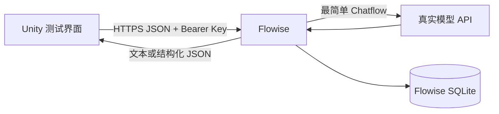

# PetTrip Agent 到 Unity 联通验证方案

本方案用于快速验证 Agent 产生的文本和结构化数据能否被 Unity 稳定接收、解析和恢复。
验证对象是 `Agent -> Unity` 的数据通路；Flowise、SQLite 和 API Key 只是本轮实验夹具，
不是最终产品架构。

<!-- prettier-ignore -->
> [!NOTE]
> 这是实验性验证。第一轮直接使用 Flowise 的同步非流式 Prediction API，不先建设
> PetTrip 异步任务服务。只有实测出现超时、断线恢复或长任务需求时，才增加异步包装。

## 1. 验证问题

本轮必须用真实服务器和真实 Agent 回答以下问题：

1. Unity 能否通过 HTTPS 和 Bearer API Key 调用服务器上的 Agent。
2. Unity 能否接收并显示 Agent 的普通文本回复。
3. Unity 能否把 Agent 返回的固定结构化 JSON 反序列化为 C# DTO。
4. Unity 和 Flowise 重启后，能否通过 `sessionId` 恢复历史消息。
5. 请求失败、响应非法或鉴权失败时，Unity 能否明确报错且不崩溃。

本轮不评价 Agent 的内容质量、Prompt 质量和场景设计质量。只要真实模型完成一次回复，
且数据能跨越服务器与 Unity 边界，就算形成有效证据。

## 2. 验证结论的适用范围

通过本轮只能证明 Unity 能消费一个外部 Agent 服务的文本和结构化结果。不能据此宣称
正式场景生成、异步任务、图片传输或生产鉴权已经完成。



## 3. 技术选择

本轮选择 Flowise 是因为它已经提供 Agent HTTP API、会话、SQLite 和 Flow 级 API Key，
可以减少自研外围服务。Unity 使用现有能力，不增加数据库或 JSON 插件。

| 部分 | 选择 | 本轮用途 |
| --- | --- | --- |
| Agent 服务 | Flowise 单实例 | Chatflow、Prediction API、消息历史 |
| Agent 内核 | Flowise 中最简单的 Chat Model/Agent 节点 | 调用一次真实模型并返回结果 |
| 持久化 | Flowise 默认 SQLite | 保存 Flow、会话和消息 |
| 鉴权 | Flow 级 Bearer API Key | 限制联调接口访问 |
| 网络 | HTTPS 反向代理 | 让 Unity 安全访问服务器 |
| Unity HTTP | `UnityWebRequest` | POST 请求和 GET 历史记录 |
| Unity JSON | `JsonUtility` | 解析简单、固定的 C# DTO |

Flowise API Key 只用于内部联调。固定 Key 打包进 Unity 后可以被提取，因此它不能作为
正式玩家身份凭据。模型提供方 API Key 只能保存在 Flowise 服务器中。

## 4. 非目标

以下能力不进入本轮，避免外围建设掩盖真正的联通问题：

- 不使用 pi-agent、OpenClaw、Dify、AG-UI 或第二套 Agent 框架。
- 不实现 `queued -> running -> succeeded/failed` 异步任务状态机。
- 不接入 Redis、独立 Worker、自定义 SQLite 表或 PetTrip API 网关。
- 不接入图片生成、文件上传、ComfyUI、视觉分割或对象存储。
- 不接入 `WorldSpec`、`ScenePlan` 或正式 `SceneSnapshot` Workflow。
- 不允许 Agent 文本直接创建 Prefab、修改脚本或执行 Unity 行为。
- 不测试 SSE、WebSocket 或逐 token 流式显示。

## 5. 统一测试数据

所有会话使用同一个测试用户和场景请求，避免输入变化影响结果判断。

```text
pilot_id: pilot-agent-unity-20260813-001
session_id: unity-pilot-device-001
question: 我想去一个有灯塔的海边，请用一句话描述这个目的地。
```

结构化数据使用以下固定 Schema。字段保持扁平和简单，确保 Unity `JsonUtility` 无需
额外插件即可解析。

```json
{
  "type": "scene_draft",
  "schema_version": "0.1",
  "title": "潮汐灯塔",
  "theme": "seaside",
  "summary": "一处可供宠物散步和观察潮汐的海边目的地。",
  "landmark_kind": "lighthouse"
}
```

## 6. 环境与配置

开始验证前，先确认以下资源真实可用。缺少任一必需项时，记录缺项并停止对应会话，
不能用 Mock 或手工复制响应代替。

### 6.1 服务器要求

服务器必须具备：

- Docker，或 Node.js 20 及可运行的 Flowise。
- 一个持久化目录，用于保存 Flowise SQLite 和加密配置。
- 一个真实可用的模型 API Key。
- 一个 Unity 可访问的 HTTPS 地址。
- 一个专门用于本轮联调的 Flow 级 API Key。

Flowise 使用固定版本镜像，不能使用未记录版本的 `latest` 作为最终验证证据。实际镜像
标签、Flowise 版本、模型和反向代理版本必须写入 `versions.txt`。

### 6.2 Flowise 要求

Flowise 中只创建两个最小 Flow：

- `text-pilot`：接收问题并返回普通文本。
- `json-pilot`：忽略开放式发挥，按固定 Schema 返回 JSON。

两个 Flow 必须分别绑定 Flow 级 API Key。模型凭据保存在 Flowise Credential Store，
不得出现在导出的 Flow JSON、日志或 Unity 配置中。

### 6.3 Unity 要求

Unity 测试界面只需要以下控件：

- 一个问题输入框。
- 一个**发送文本**按钮。
- 一个**请求结构化数据**按钮。
- 一个**读取历史**按钮。
- 一个状态文本区域。
- 一个 Agent 文本回复区域。
- 一个结构化草稿展示区域。

Unity 将服务器 Base URL、Flow ID 和演示 API Key 放入开发环境配置。发布构建不得使用
本轮演示 Key。

## 7. Flowise 调用契约

Unity 直接使用 Flowise 官方 Prediction API。本轮设置 `streaming: false`，让一次请求
返回完整 JSON。

### 7.1 文本请求

Unity 调用：

```http
POST /api/v1/prediction/{textFlowId}
Authorization: Bearer <pilot-api-key>
Content-Type: application/json
```

请求体：

```json
{
  "question": "我想去一个有灯塔的海边，请用一句话描述这个目的地。",
  "streaming": false,
  "overrideConfig": {
    "sessionId": "unity-pilot-device-001"
  }
}
```

Unity 至少读取以下响应字段：

```json
{
  "text": "潮汐灯塔坐落在安静的海湾边，宠物可以沿着沙滩散步。",
  "chatId": "chat-12345",
  "chatMessageId": "msg-67890",
  "sessionId": "unity-pilot-device-001"
}
```

### 7.2 结构化请求

Unity 调用同一个 Prediction API，但使用 `json-pilot` 的 Flow ID。Flow 必须返回符合
固定 Schema 的 JSON；Unity 不从自然语言代码块中截取 JSON。

Flowise Prediction 响应允许包含 `json` 字段。Unity 端为外围响应和业务数据分别定义
DTO，避免把动态 JSON 直接映射为游戏行为。

```csharp
[Serializable]
public class FlowisePredictionResponse
{
    public string text;
    public SceneDraft json;
    public string chatId;
    public string chatMessageId;
    public string sessionId;
}

[Serializable]
public class SceneDraft
{
    public string type;
    public string schema_version;
    public string title;
    public string theme;
    public string summary;
    public string landmark_kind;
}
```

### 7.3 会话历史请求

Unity 使用 Flowise Chat Message API 查询本轮会话：

```http
GET /api/v1/chatmessage/{textFlowId}?sessionId=unity-pilot-device-001&order=ASC
Authorization: Bearer <pilot-api-key>
```

Unity 只显示消息角色、内容和时间。消息历史不能触发任何游戏逻辑。

## 8. 四会话验证计划

四个会话必须按顺序执行。前一个会话未通过时，不得把后续会话标记为通过。

### 会话 1：Flowise 服务与鉴权

本会话只证明服务器可访问，并且 Flow 级 API Key 生效。

1. 部署固定版本的 Flowise，并挂载持久化目录。
2. 配置真实模型凭据和 `text-pilot` Flow。
3. 为 `text-pilot` 绑定专用 API Key。
4. 从 Unity 所在网络请求 Flowise 健康检查。
5. 使用无 Key、错误 Key和正确 Key分别请求 Prediction API。
6. 保存三次请求的状态码和脱敏响应。

通过条件：正确 Key 请求进入 Flow；无 Key和错误 Key均返回 `401`；响应和日志中不包含
模型 API Key。

### 会话 2：真实 Agent 文本到 Unity

本会话证明真实模型回复可以穿过 Flowise 并由 Unity 显示。

1. Unity 使用统一问题调用 `text-pilot`，并设置固定 `sessionId`。
2. Flowise 调用真实模型，返回非流式完整响应。
3. Unity 解析 `text`、`chatId`、`chatMessageId` 和 `sessionId`。
4. Unity 在主线程更新状态和回复文本。
5. 保存 Unity 截图、客户端日志和脱敏 HTTP 记录。

通过条件：Unity 显示真实 Agent 回复；返回的 `sessionId` 与请求一致；Unity 不冻结、
不崩溃，且没有 JSON 解析错误。

### 会话 3：结构化 JSON 到 Unity DTO

本会话证明 Agent 数据可以通过白名单 Schema 进入 Unity，而不是让自由文本驱动游戏。

1. 配置 `json-pilot` 返回固定的 `SceneDraft v0.1` 结构。
2. Unity 调用 `json-pilot` 并解析外围响应。
3. Unity 将 `json` 字段反序列化为 `SceneDraft`。
4. Unity 逐字段展示标题、主题、摘要和地标类型。
5. 将 `schema_version` 改为不支持的版本，再执行一次负例请求。
6. 让 Flow 返回缺少 `title` 的无效结果，再执行一次负例请求。

通过条件：合法结果完整映射到 DTO；不支持版本和缺少必填字段的结果被 Unity 拒绝；
任何结果都不会创建 GameObject、加载资源或执行脚本。

### 会话 4：SQLite 持久化与恢复

本会话证明会话消息在客户端或服务端重启后仍可查询。

1. 使用同一 `sessionId` 连续完成至少两轮文本对话。
2. 关闭并重新打开 Unity，调用历史消息 API。
3. 确认历史消息顺序、角色和内容与原对话一致。
4. 重启 Flowise 容器，重新调用历史消息 API。
5. 再发送一条消息，确认会话仍可继续。
6. 检查持久化目录中的 SQLite 文件在容器重建后仍存在。

通过条件：Unity 和 Flowise 分别重启后，历史消息均可恢复；新消息继续使用原
`sessionId`；SQLite 不由 Unity 直接读取。

## 9. 失败场景

除四个主会话外，至少验证以下失败行为。失败测试只验证外部行为，不要求 Unity 知道
Flowise 或模型提供方的内部异常类型。

| 场景 | 期望结果 |
| --- | --- |
| Flow API Key 缺失或错误 | Unity 收到 `401`，停止请求并显示鉴权失败 |
| Flow ID 不存在 | Unity 显示资源不存在，不自动切换其他 Flow |
| 服务器不可达 | Unity 在超时后恢复可操作状态，允许人工重试 |
| 模型 API 失败 | Unity 显示 Agent 服务失败，不展示内部堆栈或凭据 |
| 响应不是 JSON | Unity 拒绝解析，保留脱敏错误记录 |
| `SceneDraft` 缺少必填字段 | Unity 拒绝业务数据，不执行任何场景行为 |
| `schema_version` 不支持 | Unity 明确提示版本不兼容 |
| 用户重复点击 | 发送期间按钮禁用，或只保留一次明确请求 |

## 10. 证据目录

每个会话必须落盘可复查证据，不能只凭界面观察或口头说明判定通过。

```text
pilot4mvp2/runs/pilot-agent-unity-20260813-001/
  README.md
  versions.txt
  flowise/
    text-pilot-export.json
    json-pilot-export.json
    deployment-config.redacted.txt
  requests/
    auth-without-key.txt
    auth-invalid-key.txt
    text-request.json
    text-response.redacted.json
    scene-draft-request.json
    scene-draft-response.redacted.json
    history-response.redacted.json
  unity/
    text-success.png
    scene-draft-success.png
    history-recovered.png
    client.log
  validation-report.json
```

任何证据文件都不得包含 Flow API Key、模型 API Key、Cookie、完整 Authorization
Header 或服务器私有配置。

## 11. 验收清单

本轮完成时逐项确认：

- [ ] Unity 可通过 HTTPS 访问固定版本的 Flowise。
- [ ] 无 Key 和错误 Key 均无法调用受保护 Flow。
- [ ] 正确 Key 可以完成一次真实 Agent 调用。
- [ ] Unity 能显示非流式文本回复。
- [ ] Unity 能读取并保留 `sessionId`。
- [ ] Unity 能将合法 `SceneDraft v0.1` 映射为 C# DTO。
- [ ] Unity 会拒绝非法或版本不兼容的结构化结果。
- [ ] Unity 重启后能恢复至少两轮历史消息。
- [ ] Flowise 重启后能恢复同一会话并继续对话。
- [ ] Unity 不直接访问 SQLite。
- [ ] Unity 不包含模型提供方 API Key。
- [ ] 所有请求、响应、截图、版本和失败结果均已脱敏落盘。

全部通过后，可以得出以下结论：

> 一个部署在服务器上的开源 Agent 服务可以通过 HTTPS、Bearer API Key 和 JSON 与
> Unity 交换文本、结构化数据和会话历史。

不能得出以下结论：

> 当前方案已经满足正式玩家鉴权、长耗时任务、场景生成或生产可靠性要求。

## 12. 异步包装的升级门

本轮先测量真实请求耗时和失败表现，不预先实现异步任务 API。出现以下任一情况时，
下一阶段才在 Flowise 前增加 PetTrip API 网关和任务状态机：

- Agent 请求经常超过 Unity 或反向代理的请求超时。
- Unity 断线后必须恢复仍在运行的请求。
- 正式流程加入生图、文件处理、场景组装或人工审核。
- 产品需要可靠取消、自动重试、进度展示或幂等提交。
- 需要隐藏 Flow ID、统一多个 Agent 实现或签发短期玩家 Token。

升级后的边界是：

```text
Unity
  -> PetTrip API：任务、鉴权、幂等和业务 Schema
  -> Flowise 或其他 Agent Runner
```

此时 Flowise 可以继续作为 Agent 执行器，也可以替换为 Agno、pi Agent Core 或自研
Workflow；Unity 的正式业务 API 不再与具体 Agent 项目绑定。

## 13. 下一步

下一次实施从会话 1 开始：锁定 Flowise 版本、准备服务器 HTTPS 地址、配置真实模型
凭据，并创建两个最小 Flow。会话 1 通过后，再在 Unity 中编写 `UnityWebRequest` 和
简单 DTO；不要提前实现异步队列或正式场景逻辑。
